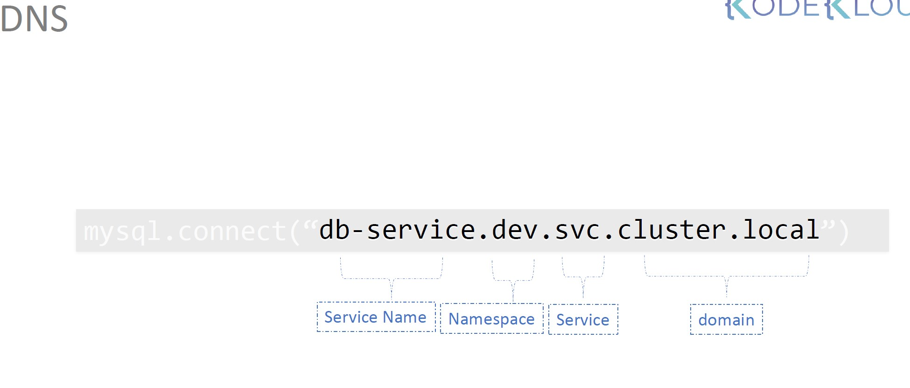
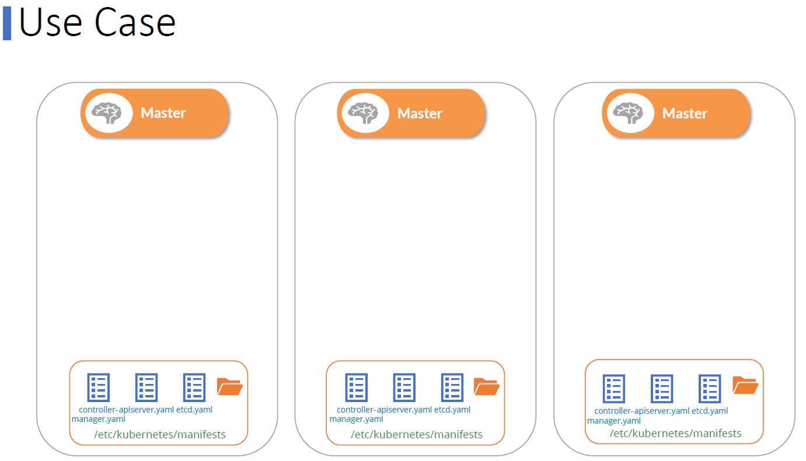
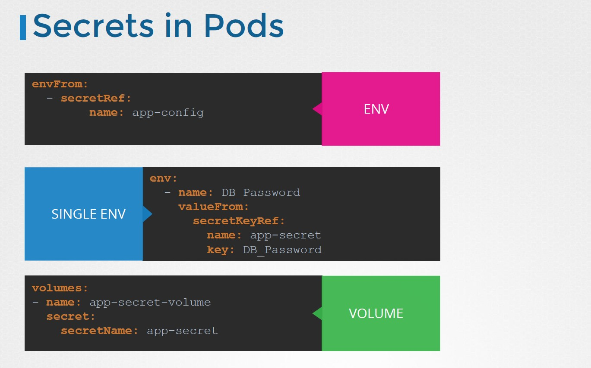
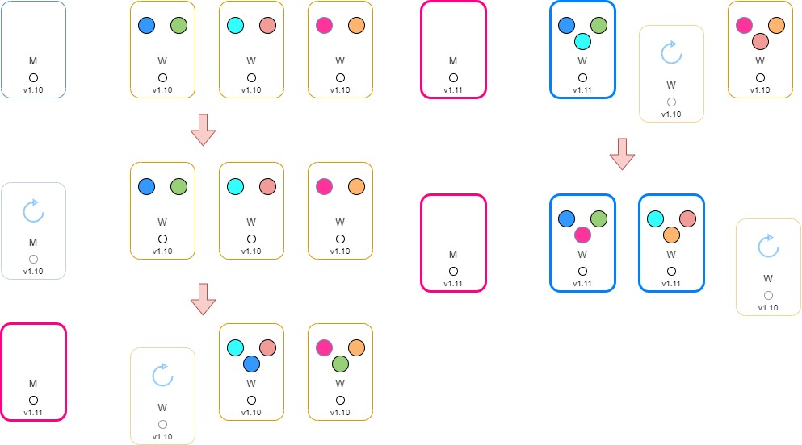

# Kubernetes CKA Personal Notes

https://github.com/mmumshad/kubernetes-the-hard-way
https://github.com/kodekloudhub/certified-kubernetes-administrator-course

What we're learning

```
High Availability Deployment
Kubernetes Scheduler
Logging / Monitoring
Application Lifecycle
Security
Maintenance
Troubleshooting
Core concepts

Auto scaling a cluster
Horizontal POD autoscalers
Stateful Sets
Kubernetes Federation
Admission Controllers
```

## Cluster Architecture

#### **Commands**

- If you have deploy Kubernetes with `Kubeadm`, you can see the different components in specified PODs :

```
🥃 ~ kubectl get pods -n kube-system

NAME                                 READY   STATUS    RESTARTS      AGE
coredns-787d4945fb-gslzl             1/1     Running   1 (99m ago)   23h
coredns-787d4945fb-wxhwz             1/1     Running   1 (99m ago)   23h
etcd-kubemaster                      1/1     Running   1 (99m ago)   23h
kube-apiserver-kubemaster            1/1     Running   1 (99m ago)   23h
kube-controller-manager-kubemaster   1/1     Running   1 (99m ago)   23h
kube-proxy-gcgfq                     1/1     Running   0             22h
kube-proxy-rw925                     1/1     Running   0             22h
kube-proxy-tv7wg                     1/1     Running   1 (99m ago)   23h
kube-scheduler-kubemaster            1/1     Running   1 (99m ago)   23h
weave-net-6dlz5                      2/2     Running   3 (99m ago)   22h
weave-net-bq29n                      2/2     Running   0             22h
weave-net-ls9d9                      2/2     Running   0             22h
```

&nbsp;

### <ins>**ETCD**</ins>

The <mark>ETCD</mark> key-value store stores cluster information and state, such as :

```
- nodes
- pods
- configs
- secrets
- accounts
- roles
- bindings
- others
```

Each data you get with `kubectl get` command is from the etcd server. Every change you make in the cluster (like adding nodes, deploying pods, etc.) are <ins>**updated in the ETCD server**</ins>.

Etcd listens to the `advertise client url` on port `2379`.

&nbsp;

> If you deploy a cluster from scratch without the `Kubeadm` tool, you have to download the binary separately.

If you have deployed an HA environment, make sure that **ETCD instances know about each other** by specifying in the service the different instances of the etcd service.

&nbsp;

<!--- Center image --->
<div align="center">
  <a href="assets/CKA_Etcd_HA.jpg" target="_blank">
    
  </a>
</div>
<div align="center">
  <i>In the picture, normally you have  <b>multi master nodes</b> exposing the <b>2379</b> port where etcd services will listen.</i>
</div>

&nbsp;

> #### Kubectl
>
> ---

https://technekey.com/check-whats-inside-the-etcd-database-in-kubernetes/

- Grab the Client certificate and key details of the API-server

```bash
🥃 ~ kubectl get pod -n kube-system -o yaml |grep -i etcd

      kubeadm.kubernetes.io/etcd.advertise-client-urls: https://192.168.56.2:2379
      component: etcd
    name: etcd-kubemaster
      - etcd
      - --cert-file=/etc/kubernetes/pki/etcd/server.crt
      - --data-dir=/var/lib/etcd
      - --key-file=/etc/kubernetes/pki/etcd/server.key
      - --peer-cert-file=/etc/kubernetes/pki/etcd/peer.crt
      - --peer-key-file=/etc/kubernetes/pki/etcd/peer.key
      - --peer-trusted-ca-file=/etc/kubernetes/pki/etcd/ca.crt
      - --trusted-ca-file=/etc/kubernetes/pki/etcd/ca.crt
      image: registry.k8s.io/etcd:3.5.6-0
      name: etcd
      - mountPath: /var/lib/etcd
        name: etcd-data
      - mountPath: /etc/kubernetes/pki/etcd
        name: etcd-certs
        path: /etc/kubernetes/pki/etcd
      name: etcd-certs
        path: /var/lib/etcd
      name: etcd-data
      image: registry.k8s.io/etcd:3.5.6-0
      imageID: registry.k8s.io/etcd@sha256:dd75ec974b0a2a6f6bb47001ba09207976e625db898d1b16735528c009cb171c
      name: etcd
      - --etcd-cafile=/etc/kubernetes/pki/etcd/ca.crt
      - --etcd-certfile=/etc/kubernetes/pki/apiserver-etcd-client.crt
      - --etcd-keyfile=/etc/kubernetes/pki/apiserver-etcd-client.key
      - --etcd-servers=https://127.0.0.1:2379
```

- Use etcdctl to query ETCD

```bash
🥃 ~ ETCDCTL_API=3 etcdctl --endpoints <ETCD-SERVER-IP:PORT> --cert=<CLIENT-CERT-FROM-ABOVE-OUTPUT> --key=<CLIENT-KEY-FROM-ABOVE-OUTPUT> --cacert=<CA-CERT-FROM-ABOVE-OUTPUT> <ETCD-SUBCOMMANDS-HERE>

# ETCD-SERVER-IP:PORT =  https://192.168.56.2:2379
# CLIENT-CERT-FROM-ABOVE-OUTPUT = /etc/kubernetes/pki/etcd/server.crt
# CLIENT-KEY-FROM-ABOVE-OUTPUT = /etc/kubernetes/pki/etcd/server.key
# CA-CERT-FROM-ABOVE-OUTPUT = /etc/kubernetes/pki/etcd/ca.crt
# ETCD-SUBCOMMANDS-HERE = member list

3ec8d20e7e3a97b3, started, kubemaster, https://192.168.56.2:2380, https://192.168.56.2:2379
```

- Checking the structure of ETCD keys (same command as above) : listing all keys stored by Kubernetes (**To run inside the etcd-master POD**). The root directory is a registry and under that we have various Kubernetes contructs.

```
🥃 ~  sudo ETCDCTL_API=3 etcdctl --endpoints https://192.168.56.2:2379 --cert=/etc/kubernetes/pki/etcd/server.crt --key=/etc/kubernetes/pki/etcd/server.key --cacert=/etc/kubernetes/pki/etcd/ca.crt get /registry/ --prefix --keys-only

/registry/apiregistration.k8s.io/apiservices/v1.

/registry/apiregistration.k8s.io/apiservices/v1.admissionregistration.k8s.io

/registry/apiregistration.k8s.io/apiservices/v1.apiextensions.k8s.io
```

&nbsp;

<!--- Center image --->
<div align="center">
  <a href="assets/CKA_Etcd_Registry.jpg" target="_blank">
    
  </a>
</div>

&nbsp;

- Querying the list of pods in the default namespace (here, the list of services in the kube-system namespace)

```
🥃 ~ sudo ETCDCTL_API=3 etcdctl --endpoints https://192.168.56.2:2379 --cert=/etc/kubernetes/pki/etcd/server.crt --key=/etc/kubernetes/pki/etcd/server.key --cacert=/etc/kubernetes/pki/etcd/ca.crt get /registry/ --prefix --keys-only |grep pods/default

# pods/default = services/specs/kube-system

/registry/services/specs/kube-system/kube-dns
```

&nbsp;

### <ins>**API server**</ins>

The primary management component in Kubernetes. Responsible for all orchestration operations with the cluster.

- Exposing Kube-API/Mgmt
- Monitors state of Cluster
- Gives work to worker nodes

When running `kubectl` command, the kubectl utility is reaching to the kube-apiserver by :

```
- authenticating the request and validating it
- then retrieveing the data from the etcd cluster
- and responding back with the requested information
```

&nbsp;

<!--- Center image --->
<div align="center">
  <a href="assets/CKA_API_Server_1.jpg" target="_blank">
    
  </a>
</div>

&nbsp;

Here, the API server will create a POD :

- It will update the ETCD cluster and update the user that the pod has been created.
- The `scheduler` realizes a new pod is created without an assigned node so it will assign it to the right node and communicates that back to the API server that will update the information in ETCD server.
- Then the API server passes the information to the `kubelet` in the appropriate corker node
- The kubelet then created the POD on the node and instructs the Container RE to deploy the application image.
- Once done, the kubelet updates the status back to the API server
- Then the API server updates the data in back in the ETCD cluster

&nbsp;

<!--- Center image --->
<div align="center">
  <a href="assets/CKA_API_Server_2.jpg" target="_blank">
    
  </a>
</div>

&nbsp;

### <ins>**Controller Manager**</ins>

It is a process that continuously monitors the state of various components within the system and works towards bringing the whole system to the desired functioning state.

It does that through the `API server`.

&nbsp;

#### **Node-Controller**

This controller takes care of nodes, onboarding new nodes to cluster and handling situation where nodes become unavailable and gets destroyed.

&nbsp;

Below we have this example :

- tests the status of the nodes every 5 seconds.
- waits for 40 seconds before declaring a node unreachable.
- After making it unreachable, it gives it 5 minutes to come back up (if it doesn't it removes the PODs assigned to this node and provision them on the healthy ones, **ONLY** if the PODs are part of a replica set).\*

<!--- Center image --->
<div align="center">
  <a href="assets/CKA_Controller_Manager_1.jpg" target="_blank">
    
  </a>
</div>

&nbsp;

#### **Replication-Controller**

The Replication-Controller :

- responsible for monitoring the status of **replica sets**
- ensuring that the desired number of PODs are available at all times within the set (if a POD dies, it creates another one)

&nbsp;

<!--- Center image --->
<div align="center">
  <a href="assets/CKA_Controller_Manager_2.jpg" target="_blank">
    
  </a>
</div>

&nbsp;

We have different controllers :

<!--- Center image --->
<div align="center">
  <a href="assets/CKA_Controller_Manager_3.jpg" target="_blank">
    
  </a>
</div>

&nbsp;

### <ins>**Kube-Scheduler**</ins>

Responsible for scheduling / deciding which pods goes on which node (it is `kubelet` who creates the pod on the ships).

How does the scheduler assign these pods ? It checks the hardware requirements (CPU, memory) and try yo identify the best node for the pod. By steps, by default :

```
1. Filter nodes (resource requirements)
2. Rank nodes (calculate the ammount of free resources, after having placing the pod on them)
```

This filter can be customized and we also can create our own scheduler.

<!--- Center image --->
<div align="center">
  <a href="assets/CKA_Scheduler.jpg" target="_blank">
    
  </a>
</div>

&nbsp;

### <ins>**Kubelet**</ins>

- They register a node in a Kubernetes cluster.
- When receiving instructions to load a container or a pod on the node, they request the container RE to pull the required image and run the instance
- Then they continue to monitor the state of the pod and containers in itand reports to the Kube API server on a timely basis.

<!--- Center image --->
<div align="center">
  <a href="assets/CKA_Kubelet.jpg" target="_blank">
    
  </a>
</div>

&nbsp;

### <ins>**Kube-Proxy**</ins>

- Within a Kubernetes cluster, every pod can reach every other pod. It is possble by deploying a `POD virtual network` that spans across all the nodes in the cluster to which all po ds connect to.

- In 1 node we have a web application communicating with a DB (installed in the other node), by using a `service` name, who exposes the DB application accross the cluster (the name is **db**).

- Whenever a pod tries to reach the service, using its IP or name, the service will forward the traffic to the backend pod.

- The service can not join the POD network because it is not a container or pod, it doesn't have any interfaces or an actively listening process. **It is a virtual component that only lives in `Kubernetes memory`**

&nbsp;

> The service should be accessible accross the cluster from any nodes. It is possible due to a `Kube-proxy`.
>
> It is a process running on each node in the Kubernetes cluster.
>
> Its job is to look for new services and every time a new service is created, it creates the appropriate rules on each node to forward traffic to those services to the pods.
>
> One way to create the rules, it is by using `IP tables` rules.

&nbsp;

<!--- Center image --->
<div align="center">
  <a href="assets/CKA_Kube_Proxy.jpg" target="_blank">
    
  </a>
</div>

<div align="center">
  <i>In this case, the kube-proxy creates an <b>IP table rule</b> on each node in the cluster to forward traffic (from <b>10.32.0.14</b>) heading to the IP service (<b>10.96.0.12</b>) to the IP of the actual pod (<b>10.32.0.15</b>)</i>
</div>

&nbsp;

---

&nbsp;

## Namespaces

A <mark>Namespace</mark> is an isolated environment where you define your set of POD, service, replica sets or deployment objects. Each time we create aone of them, it is created into a `default ` namespace.

When you have to manage a Production environment, it is advised to define a `dev`, `prod` namespaces to avoid accidentally deleting some objects.

When first setting up a Kubernetes cluster we alreday define 3 namespaces :

- `default` : where you create your obejects without specifying a namespace
- `kube-system` : networking, DNS, ... pods are running there.
- `kube-public` : where we create available resources to all users

<!--- Center image --->
<div align="center">
  <a href="assets/CKA_Namespace_1.jpg" target="_blank">
    
  </a>
</div>

&nbsp;

In each namespace, you define a specific `policy` where you assign a quota of resources.

<!--- Center image --->
<div align="center">
  <a href="assets/CKA_Namespace_2.jpg" target="_blank">
    
  </a>
</div>

&nbsp;

<!--- Center image --->
<div align="center">
  <a href="assets/CKA_Namespace_3.jpg" target="_blank">
    
  </a>
  <a href="assets/CKA_Namespace_4.jpg" target="_blank">
    
  </a>
</div>

<div align="center">
  <i>When a Web app pod coomunicates with a service <b>in the same namespace</b>, it only need s to specify its name. When communicating with a service <b>from another space</b>, we need to append to the service name, the <b>NAMESPACE_NAME.svc.cluster.local</b> format</i>
</div>

&nbsp;

> #### Kubectl
>
> ---

- Display Pods in the `kube-system` namespace

```
🥃 ~ kubectl get pods --namespace=kube-system

NAME                                     READY   STATUS    RESTARTS      AGE
coredns-565d847f94-9swt6                 1/1     Running   0             2d7h
coredns-565d847f94-pmk6k                 1/1     Running   0             2d7h
etcd-docker-desktop                      1/1     Running   0             2d7h
kube-apiserver-docker-desktop            1/1     Running   0             2d7h
kube-controller-manager-docker-desktop   1/1     Running   0             2d7h
kube-proxy-gcc2p                         1/1     Running   0             2d7h
kube-scheduler-docker-desktop            1/1     Running   0             2d7h
storage-provisioner                      1/1     Running   1 (20s ago)   2d7h
vpnkit-controller                        1/1     Running   1 (19s ago)   2d7h
```

- To create a `dev` namespace

```
🥃 ~ kubectl create namespace dev
```

&nbsp;

> #### YAML
>
> ---

You can run `kubectl create -f pod-definition.yml --namespace=dev` or also define the `namespace` property in Yaml file for **creating a POD in a specific namespace** :

```yaml
### pod-definition.yml

apiVersion: v1
kind: Pod
metadata:
  name: mypostgres-pod
  # Here
  namespace: dev
  labels:
    app: mypostgres
    tier: db-tier
spec:
  containers:
    - name: postgres-container
      image: postgres
      env:
        - name: POSTGRES_PASSWORD
          value: mysecretpassword
```

To create a namespace :

```yaml
### namespace-dev.yml

apiVersion: v1
kind: Namespace
metadata:
  name: dev
```

&nbsp;

---

&nbsp;

## Scheduling

> REMINDER : The scheduler is responsible for scheduling / deciding which pods goes on which node.

&nbsp;

### <ins>**When there is no scheduler to monitor**</ins>

The Pod is in `Pending` state. To resolve this issue, you can manually assing pods to nodes yourself by setting the `nodeName` property in pod specification file.

```bash
🥃 ~ kubectl get pods

NAME    READY   STATUS    RESTARTS   AGE
nginx   0/1     Pending   0          24s
```

&nbsp;

### <ins>**Manual scheduling**</ins>

Every POD has a `nodeName` property which is **NOT SET** by default :

```yaml
### pod-definition.yml

apiVersion: v1
kind: Pod
metadata:
  name: nginx-pod
  labels:
    name: nginx
spec:
  containers:
    - name: nginx-container
      image: nginx
      ports:
        - containerPort: 8080
      # By default it is not specified
      nodeName:
```

Kubernetes adds it automatically :

- The scheduler goes through all the pods and looks for those that do not have this property set.
- It then identifies the right node for the pod by running a scheduling algorithm.
- Once identified, it schedules the pod on the node by setting the `nodeName` property by creating a binding object

&nbsp;

<!--- Center image --->
<div align="center">
  <a href="CKA_Manual_Scheduling_1.jpg" target="_blank">
    
  </a>
</div>

&nbsp;

#### **What if the pod is already created and we want to assign to a node ?**

Kubernets will not allow us to modify the `nodeName` property of a pod. The solutions :

- creating a binding object and send a POST request to the pod's binding API (thus mimicking what the scheduler does)

```yaml
### Pod-bind-definition.yml

apiVersion: v1
kind: Binding
metadata:
  name: nginx-bind
target:
  apiVersion: v1
  kind: Node
  # You target with the name of the node
  name: node02
# curl --header "Content-Type:application/json" --request POST --data '{"apiVersion":"v1", "kind": "Binding“ …. }' http://$SERVER/api/v1/namespaces/default/pods/$PODNAME/binding/
```

- OR running `kubectl replace --force -f pod-definition.yml` after having edited the pod-definition.yml

&nbsp;

### <ins>**Labels and Selectors**</ins>

As already told in the beginner's courses, <mark>Labels</mark> are used to catgorize Kubernetes objects (PODs, services, etc.) and <mark>Selector</mark> is used to filter them when doing a research.

```bash
# We are looking for PODs having this label 'env : dev'
🥃 ~ kubectl get pods --selector env=dev

NAME          READY   STATUS    RESTARTS   AGE
db-1-b8zlr    1/1     Running   0          104s
app-1-46r64   1/1     Running   0          104s
db-1-gsvcl    1/1     Running   0          104s
app-1-5wpqm   1/1     Running   0          104s
db-1-qbg9k    1/1     Running   0          104s
app-1-54w6j   1/1     Running   0          104s
db-1-bx8rd    1/1     Running   0          103s


# We want all Kubernetes objects which are part of the env: prod, the bu: finance and of tier: frontend
🥃 ~ kubectl get all --selector env=prod,bu=finance,tier=frontend

NAME              READY   STATUS    RESTARTS   AGE
pod/app-1-zzxdf   1/1     Running   0          8m48s
```

&nbsp;

### <ins>**Taints and Tolerations (Pod to Node relationship)**</ins>

<mark>Taints</mark> and <mark>Tolerations</mark> have nothing to do with security or in trusion on the cluster : they are used to set restrictions **on what pods can be scheduled on a node**.

It is used when we decide to use a node for a specific use case.

&nbsp;

#### **How can you restrict what pods are placed on what nodes ?**

The `taint-effect` defines what would happen to the PODs if they do not tolerate the taint. There are 3 taint effects :

- `NoSchedule` : pods will not be scheduled on the node
- `PreferNoSchedule` : the system will try to avoid placing the pod on the node but it is not guaranteed
- `NoExecute` : new pods will not be scheduled on the node and existing pods will be evicted if they don't tolerate the taint.

```bash
# Apply a taint to a node : kubectl taint nodes node-name key=value:taint-effect
🥃 ~ kubectl taint nodes node1 app=blue:NoSchedule

# To untaint a node, add a "-" at the end
🥃 ~ kubectl taint nodes node1 app=blue:NoSchedule-
```

<mark>Tolerations</mark> are added to pods :

```yaml
### pod-definition.yml

apiVersion: v1
kind: Pod
metadata:
  name: nginx-pod
  labels:
    name: nginx
spec:
  containers:
    - name: nginx-container
      image: nginx
      ports:
        - containerPort: 8080
  # Here, in DOUBLE QUOTES
  tolerations:
    - key: "app"
      operator: "Equal"
      value: "blue"
      effect: "NoSchedule"
```

For information, a Taint is already applied to the `master` node when cluster is created, for avoiding PODs to be scheduled in this node.

&nbsp;

### <ins>**Node selector & Node affinity**</ins>

We can set a limition on the pods so that they only run on particular nodes. There are 2 methods :

- <mark>Node Selector</mark> : we add a `nodeSelector` property at the pod-definition file. Before we must add labels to nodes.

```bash
# Add "size: Large" label to node : kubectl label nodes <node-name> <label-key>=<label-value>
🥃 ~ kubectl label nodes node01 size=Large
```

```yaml
### pod-definition.yml

apiVersion: v1
kind: Pod
metadata:
  name: nginx-pod
  labels:
    name: nginx
spec:
  containers:
    - name: nginx-container
      image: nginx
      ports:
        - containerPort: 8080
  # We specify the size as "Large" if we want to run on a node with high resources
  # "size: Large" label in nodes MUST BE DEFINED prior to creating the pod
  nodeSelector:
    size: Large
```

&nbsp;

- <mark>Node Affinity</mark> : Node selector has its limitations because we just use a simple label, no advanced expressions : this is where we use the node affinities.

```yaml
### pod-definition.yml

apiVersion: v1
kind: Pod
metadata:
  name: nginx-pod
  labels:
    name: nginx
spec:
  containers:
    - name: nginx-container
      image: nginx
      ports:
        - containerPort: 8080
  # Node Affinity
  affinity:
    nodeAffinity:
      requiredDuringSchedulingIgnoredDuringExecution:
        nodeSelectorTerms:
          - matchExpressions:
              - key: size
                # The 'In' operator ensures that the pod will be placed on a node whose label 'size' has any value in the list of values specified here
                operator: In
                # operator: NotIn
                # operator: Exists -> only checks if label exists without comparing values
                values:
                  - Large
                  - Medium
```

There are different types of affinity that define `the behaviour of the scheduler`. They come into play when for example there are no nodes with matching labels :

- Available :
  - `requiredDuringSchedulingIgnoredDuringExecution` : The pod will not be scheduled.
  - `preferredDuringSchedulingIgnoredDuringExecution` : The pod will be placed in any available node

&nbsp;

> With **IgnoredDuringExecution**, the pods already created will not be impacted by any changes.

&nbsp;

- Planned :
  - `requiredDuringSchedulingRequiredDuringExecution` : Any changes will evict pods not matching labels

&nbsp;

### <ins>**Resources limit**</ins>

Kubernetes assumes that a pod or container within a pod requires 0.5 CPU and 256 Mb of mermory: this is known as the `resource request` for a container (min resources).

For the POD to pick up those defaults you must have first set those as default values for request and limit by creating a `LimitRange` in that namespace.

```yaml
apiVersion: v1
kind: LimitRange
metadata:
  name: mem-limit-range
spec:
  limits:
    - default:
        cpu: 1
        memory: 512Mi
      defaultRequest:
        cpu: 0.5
        memory: 256Mi
      type: Container
```

We can specify requirement and limit values by editing the pod definition file :

```yaml
### pod-definition.yml

apiVersion: v1
kind: Pod
metadata:
  name: nginx-pod
  labels:
    name: nginx
spec:
  containers:
    - name: nginx-container
      image: nginx
      ports:
        - containerPort: 8080
      # Resources
      resources:
        requests:
          # It is Gibibytes, not GigaBytes
          memory: "1Gi"
          cpu: 1
        limits:
          memory: "2Gi"
          cpu: 2
```

&nbsp;

### <ins>**DaemonSets**</ins>

They are like `Replica Sets` as it helps you deploy multiple instances of pods `but it runs one copy of your pod on each node in your cluster`.

Whenever a new node is added to/removed from the cluster, a replica of the pod is automatically added to/removed from that node.

Some use cases of DS :

- Deploying a monitoring agent in the form of pod (Monitoring solution)
- Deploying a log collector (Logs Viewer)

&nbsp;

<!--- Center image --->
<div align="center">
  <a href="CKA_Daemon_Sets_1.jpg" target="_blank">
    
  </a>
</div>

<div align="center">
  <i>The DS ensures that one copy of the pod is always present in all nodes in the cluster</i>
</div>

&nbsp;

As discussed in the beginner's courses, one of the worker node components required on every node is a `kube-proxy` : **that is one good use case of DS**, the kube-proxy component can be deployed as a DS in the cluster.

<!--- Center image --->
<div align="center">
  <a href="CKA_Daemon_Sets_2.jpg" target="_blank">
    
  </a>
</div>

&nbsp;

Creating a DS definition file is like ReplicaSet

<!--- Center image --->
<div align="center">
  <a href="CKA_Daemon_Sets_3.jpg" target="_blank">
    
  </a>
</div>

&nbsp;

> #### Kubectl
>
> ---

- Listing Daemon Sets

```
🥃 ~ kubectl get daemonsets

NAMESPACE      NAME              DESIRED   CURRENT   READY   UP-TO-DATE   AVAILABLE   NODE SELECTOR            AGE
kube-flannel   kube-flannel-ds   1         1         1       1            1           <none>                   4m54s
kube-system    kube-proxy        1         1         1       1            1           kubernetes.io/os=linux   4m57s
```

&nbsp;

### Static PODs

In a normal cluster, the `kubelet` relies on the **kube API server** for instructions on what pods to load on its node, based on a decision made by the **kube scheduler** which is stored in the **etcd data store**.

<!--- Center image --->
<div align="center">
  <a href="CKA_Static_Pods_1.jpg" target="_blank">
    
  </a>
</div>

&nbsp;

#### **What if there is no master node and only 1 worker node ?**

The `kubelet` can manage a node independently : if we don't have the **kube API server** where we provide the **pod definition file**, we can configure the kubelet to read them `from a directory on a server, designated to store information about pods`.

&nbsp;

The kubelet periodically checks this directory for files, reads these files and creates pods on the host. Not only does it create the pod, it can ensure that the pod stays alive :

- If the application crashes, the kubelet attempts to restart it
- If we make a change to a file, the kubelet recreates the pod for those changes to take effect
- If we remove a file from this directory, the kubelet destroys the pod automatically

These created pods are known as <mark>Static PODs</mark>.

&nbsp;

> We can not create a Replica Set, Deployment or Service with a kubelet alone (we need the whole architecture)

> The directory could be any directory on the host, and the location is passed in to the kubelet as an option while running the service. The option is called **--pod-manifest-path** but we could instead provide it thorugh a configuration file by passing the argument **--config**

 <!--- Center image --->
<div align="center">
  <a href="CKA_Static_Pods_2.jpg" target="_blank">
    
  </a>
</div>

&nbsp;

The kubelet can create both kind of pods at the same time (the static and the ones from Kube API server). The API server is aware of the static ones (a ready-only mirrored one is created in the Kube API server).

As <mark>Static PODs</mark> are not dependent on the **Kubernetes control plane**, we can use them to deploy control plane components itself as pods on a node.

 <!--- Center image --->
<div align="center">
  <a href="CKA_Static_Pods_3.jpg" target="_blank">
    
  </a>
</div>

<div align="center">
  <i>This way, we don't have to download the binaries, configure services, or worry about the services crashing (as static pods they will be automatically restarted by the kubelet)</i>
</div>

&nbsp;

 <!--- Center image --->
<div align="center">
  <a href="CKA_Static_Pods_4.jpg" target="_blank">
    
  </a>
</div>

&nbsp;

### <ins>**Multiple schedulers**</ins>

**If you need to schedule specific applications**, you can write your own Kubernetes scheduler program, package it and deploy it as the default scheduler or as an additional scheduler in the Kubernetes cluster.

> So Kubernetes cluster can have multiple schedulers at a time : when creating a pod or deployment, we can instruct Kubernetes to have the pod scheduled by a specific scheduler.

&nbsp;

- To deploy the custom scheduler as a pod

```yaml
### my-custom-scheduler.yaml

apiVersion: v1
kind: Pod
metadata:
  name: my-custom-scheduler
  namespace: kube-system
spec:
  containers:
    - command:
        - kube-scheduler
        - --address=127.0.0.1
        # File having the authentication info to connect to Kube API server
        - --kubeconfig=/etc/kubernetes/scheduler.conf
        - --config=/etc/kubernetes/my-scheduler-config.yaml
      image: k8s.gcr.io/kube-scheduler-amd64:v1.11.3
      name: kube-scheduler
```

```yaml
### my-scheduler-config.yaml

apiVersion: kubescheduler.config.k8s.io/v1
kind: KubeSchedulerConfiguration
profiles:
  - schedulerName: my-scheduler
# Used when we have multiple  copies of the scheduler running on different master nodes as high-availability setup.
# If multiple copies of the same scheduler are running on different nodes, only one can be active at a time.
# That's where the leaderElection helps in choosing a leader whol will lead the scheduling activities
leaderElection:
  leaderElect: true
  resourceNamespace: kube-system
  resourceName: lock-object-my-scheduler
```

- To create a pod with a specific schduler

```yaml
### pod-definition.yml

apiVersion: v1
kind: Pod
metadata:
  name: nginx-pod
  labels:
    name: nginx
spec:
  containers:
    - name: nginx-container
      image: nginx
      ports:
        - containerPort: 8080
      # Choose scheduler
      schedulerName: my-custom-scheduler
```

- To know which scheduler picked up (see the REASON = Scheduled)

```bash
🥃 ~ kubectl get events -o wide

LAST SEEN   TYPE      REASON                    OBJECT              SUBOBJECT                SOURCE                                    MESSAGE                                                                              FIRST SEEN   COUNT   NAME
18s         Normal    Scheduled                 pod/nginx                                    my-scheduler, my-scheduler-my-scheduler   Successfully assigned default/nginx to controlplane                                  18s          1       nginx.1746be500cbc7585
```

- To check scheduler logs

```bash
🥃 ~ kubectl logs my-scheduler --namespace=kube-system
```

> ## When creating different schedulers, you can configure them by disabling some plugins (see `Configuring Scheduler Profiles` on udemy)

&nbsp;

---

&nbsp;

## Logging & Monitoring

> How do we monitor resource consumption on Kubernetes ? In the current version, Kubernetes doesn't provide a built-in solution.

We have to use `3rd party solution to create our Metric server`

 <!--- Center image --->
<div align="center">
  <a href="CKA_Monitor_Logs_1.jpg" target="_blank">
    
  </a>
</div>

&nbsp;

### <ins>**Metrics Server (old name : Heapster)**</ins>

We can have **one Metrics Server per Kubernetes cluster**.

It retrieves metrics from each of the Kubernetes nodes and pods, aggregates them and store them in memory.

- Node-level metric :
  - the number of nodes in the cluster
  - how many of them are healthy

&nbsp;

- Performance-level metric
  - CPU, memory, network and disc utilization

&nbsp;

- Pod-level metric
  - the number of pods
  - the preformance metrics of each pod

&nbsp;

<mark>Metrics Server</mark> is only an in-memory monitoring solution : it does not store the metrics on the disk.

It is through the a subcomponent of `Kubelet` agent, called `caAdvisor` (container advisor) that we retrieve performance metrics from pods and expose them through the `kubelet API`.

 <!--- Center image --->
<div align="center">
  <a href="CKA_Monitor_Logs_2.jpg" target="_blank">
    
  </a>
</div>

&nbsp;

- To view the cluster performance by nodes

```bash
# You have to download the component

# If you use one master node, run this command to create the metrics-server :
# kubectl apply -f https://github.com/kubernetes-sigs/metrics-server/releases/latest/download/components.yaml

# f you have HA (High availability) cluster, use this :
# kubectl apply -f https://github.com/kubernetes-sigs/metrics-server/releases/latest/download/high-availability.yaml
vagrant@kubemaster🥃 ~ kubectl top node

error: Metrics API not available

vagrant@kubemaster🥃 ~ kubectl apply -f https://github.com/kubernetes-sigs/metrics-server/releases/latest/download/components.yaml

serviceaccount/metrics-server created
clusterrole.rbac.authorization.k8s.io/system:aggregated-metrics-reader created
clusterrole.rbac.authorization.k8s.io/system:metrics-server created
rolebinding.rbac.authorization.k8s.io/metrics-server-auth-reader created
clusterrolebinding.rbac.authorization.k8s.io/metrics-server:system:auth-delegator created
clusterrolebinding.rbac.authorization.k8s.io/system:metrics-server created
service/metrics-server created
deployment.apps/metrics-server created
apiservice.apiregistration.k8s.io/v1beta1.metrics.k8s.io created

# Be sure that nodes are in Ready status
vagrant@kubemaster🥃 ~ kubectl get nodes

NAME         STATUS   ROLES           AGE   VERSION
kubemaster   Ready    control-plane   11d   v1.26.1
kubenode01   Ready    <none>          11d   v1.26.1
kubenode02   Ready    <none>          11d   v1.26.1

# Check if metrics server is running
vagrant@kubemaster🥃 ~ kubectl get deploy,svc -n kube-system | egrep metrics-server

deployment.apps/metrics-server   0/1     1            0           3h9m
service/metrics-server   ClusterIP   10.97.123.56   <none>        443/TCP                  3h9m

vagrant@kubemaster🥃 ~ kubectl get pods -n kube-system | grep metrics-server

metrics-server-68bfd5c84d-rwzx4      0/1     Running   0                3h9m

# The kube-apiserver must enable an aggregation layer. We have to configure "--kubelet-insecure-tls"
vagrant@kubemaster🥃 ~ kubectl top node

Error from server (ServiceUnavailable): the server is currently unable to handle the request (get nodes.metrics.k8s.io)

vagrant@kubemaster🥃 ~ kubectl edit deployment.apps/metrics-server -n kube-system

deployment.apps/metrics-server edited

# You have to wait for the upadte of deployment before running the command
vagrant@kubemaster🥃 ~ kubectl top node

NAME         CPU(cores)   CPU%   MEMORY(bytes)   MEMORY%
kubemaster   275m         13%    807Mi           42%
kubenode01   23m          1%     599Mi           31%
kubenode02   30m          1%     288Mi           15%
```

 <!--- Center image --->
<div align="center">
  <a href="CKA_Monitor_Logs_3.jpg" target="_blank">
    
  </a>
</div>

<div align="center">
  <i>We have to add <b>--kubelet-insecure-tls</b> property when editing the metrics server configuration</i>
</div>

&nbsp;

### <ins>**Application Logs**</ins>

&nbsp;

```bash
vagrant@kubemaster🥃 ~ kubectl run nginx --image=nginx
pod/nginx created

vagrant@kubemaster🥃 ~ kubectl get pods
NAME    READY   STATUS    RESTARTS   AGE
nginx   1/1     Running   0          23s

vagrant@kubemaster🥃 ~ kubectl edit pods nginx

apiVersion: v1
kind: Pod
metadata:
  creationTimestamp: "2023-03-01T14:41:02Z"
  labels:
    run: nginx
  name: nginx
  namespace: default
  resourceVersion: "31228"
  uid: 7f83c736-b1b7-4bb0-955d-033bc3ddc9e6
spec:
  containers:
  - image: nginx
    imagePullPolicy: Always
    name: nginx

# kubectl logs <POD_NAME> <CONTAINER_NAME>
vagrant@kubemaster🥃 ~ kubectl logs nginx nginx
/docker-entrypoint.sh: /docker-entrypoint.d/ is not empty, will attempt to perform configuration
/docker-entrypoint.sh: Looking for shell scripts in /docker-entrypoint.d/
/docker-entrypoint.sh: Launching /docker-entrypoint.d/10-listen-on-ipv6-by-default.sh
10-listen-on-ipv6-by-default.sh: info: Getting the checksum of /etc/nginx/conf.d/default.conf
10-listen-on-ipv6-by-default.sh: info: Enabled listen on IPv6 in /etc/nginx/conf.d/default.conf
/docker-entrypoint.sh: Launching /docker-entrypoint.d/20-envsubst-on-templates.sh
/docker-entrypoint.sh: Launching /docker-entrypoint.d/30-tune-worker-processes.sh
/docker-entrypoint.sh: Configuration complete; ready for start up
2023/03/01 14:41:28 [notice] 1#1: using the "epoll" event method
2023/03/01 14:41:28 [notice] 1#1: nginx/1.23.3
2023/03/01 14:41:28 [notice] 1#1: built by gcc 10.2.1 20210110 (Debian 10.2.1-6)
2023/03/01 14:41:28 [notice] 1#1: OS: Linux 4.15.0-204-generic
2023/03/01 14:41:28 [notice] 1#1: getrlimit(RLIMIT_NOFILE): 1048576:1048576
2023/03/01 14:41:28 [notice] 1#1: start worker processes
2023/03/01 14:41:28 [notice] 1#1: start worker process 29
2023/03/01 14:41:28 [notice] 1#1: start worker process 30
```

&nbsp;

---

&nbsp;

## Application Lidecycle management

&nbsp;

### <ins>**Commands and arguments in a POD definition file**</ins>

&nbsp;

> You need to have reviewed Docker commands lesson

The purpose here is to translate Docker commands into POD files. Below an example : we want to run a Ubuntu container where **it will sleep for 10 secondes after starting** :

```yaml
### pod-definition.yml

apiVersion: v1
kind: Pod
metadata:
  name: ubuntu-sleeper-pod
spec:
  containers:
    - name: ubuntu-sleeper-container
      image: ubuntu-sleeper
      # Anything appended to the docker run command will go into the args property
      # Based on the Dockerfile below, we pass the value 10 in the CMD
      args: ["10"]
      # To override an ENTRYPOINT in a container
      command: ["sleep2.0"]
```

```Dockerfile
### Dockerfile

## docker run ubuntu-sleeper sleep 10  ->  docker run <IMAGE_NAME> <CMD>
# FROM Ubuntu
# CMD sleep 10
# CMD ["sleep", "10"]  ->  CMD ["command","param1"]


## docker run ubuntu-sleeper 10  ->  sleep is now executed automatically, as ENTRYPOINT
FROM Ubuntu
# We specify the command to run automatically, avoiding to declare it in cmd line
ENTRYPOINT [“sleep”]
# Value by default if we don't specify it in the cmd line
CMD ["10"]

## To override a running container, update the entrypoint like this :
# docker run --entrypoint sleep2.0 ubuntu-sleeper 10
```

&nbsp;

### <ins>**ENV variables in Kubernetes**</ins>

```yaml
### pod-definition.yml
# docker run -e APP_COLOR=pink simple-webapp-container

apiVersion: v1
kind: Pod
metadata:
  name: simple-webapp-pod
spec:
  containers:
    - name: simple-webapp-container
      image: simple-webapp
      ports:
        - containerPort: 8080
      # env is an array. Each item has a name and value property
      env:
        - name: APP_COLOR
          value: pink
```

There are 3 ways to configure an `env` value :

<div align="center">
  <a href="CKA_LifeCycle_1.jpg" target="_blank">
    
  </a>
</div>

&nbsp;

#### **ConfigMaps**

We'll see how to work with configuration data in Kubernetes. It provides its utility by **avoiding to write a liste of `env` into the POD file** :

- We create a **`ConfigMap`** file by using an imperative or declarative approach
- We inject it into the POD

```bash
# IMPERATIVE WAY
# from-literal is used to specify the key value pairs in the command itself

vagrant@kubemaster🥃 ~ kubectl create configmap \
<CONFIG-NAME> --from-literal=<KEY>=<VALUE>

vagrant@kubemaster🥃 ~ kubectl create configmap \
app-config --from-literal=APP_COLOR=blue \
           --from-literal=APP_MODE=prod

# If we have too many env variables, we can store them into app_config.properties
vagrant@kubemaster🥃 ~ kubectl create configmap \
app-config --from-file=app_config.properties
```

```yaml
# DECLARATIVE WAY : we create a config-map.yaml
# kubectl create -f config-map.yaml

apiVersion: v1
kind: ConfigMap
metadata:
  name: app-config
# We don't have the spec property, compared to the POD, RS or Deployment
data:
  APP_COLOR: blue
  APP_MODE: prod
```

You can create as many `ConfigMap` files as you want.

<div align="center">
  <a href="CKA_LifeCycle_2.jpg" target="_blank">
    
  </a>
</div>

&nbsp;

> #### Kubectl
>
> ---

- List config maps

```bash
vagrant@kubemaster🥃 ~ kubectl get configmaps

NAME               DATA   AGE
kube-root-ca.crt   1      20m
db-config          3      14s
```

- View details to list key-value pairs

```bash
vagrant@kubemaster🥃 ~ kubectl describe configmaps db-config

Name:         db-config
Namespace:    default
Labels:       <none>
Annotations:  <none>

Data
====
DB_HOST:
----
SQL01.example.com
DB_NAME:
----
SQL01
DB_PORT:
----
3306

BinaryData
====

Events:  <none>
```

&nbsp;

3 ways to inject into POD :

<div align="center">
  <a href="CKA_LifeCycle_3.jpg" target="_blank">
    
  </a>
</div>

&nbsp;

#### **Secrets**

<mark>Secrets</mark> are used to store sensitive information. They are similir to `ConfigMaps` except that **they're stored in an encoded format**.

There are 2 steps when working with Secrets :

- Create Secret
- Inject into Pod

```bash
# IMPERATIVE WAY

vagrant@kubemaster🥃 ~ kubectl create secret generic \
<SECRET-NAME> --from-literal=<KEY>=<VALUE>

vagrant@kubemaster🥃 ~ kubectl create secret generic \
app-secret --from-literal=DB_Host=mysql \
           --from-literal=DB_User=root \
           --from-literal=DB_Password=paswrd

# If we have too many env variables, we can store them into app_config.properties
vagrant@kubemaster🥃 ~ kubectl create secret generic \
app-secret --from-file=app_secret.properties
```

```yaml
# DECLARATIVE WAY : we create a secret-data.yaml
# kubectl create -f secret-data.yaml

apiVersion: v1
kind: Secret
metadata:
  name: app-secret
# We must encod our sensitive data
# echo -n 'mysql' | base64
# echo -n 'bXlzcWw=' | base64 --decode

# echo -n 'root' | base64
# echo -n 'cm9vdA==' | base64 --decode

# echo -n 'paswrd' | base64
# echo -n 'cGFzd3Jk' | base64 --decode
data:
  DB_Host: bXlzcWw=
  DB_User: cm9vdA==
  DB_Password: cGFzd3Jk
```

&nbsp;

> #### Kubectl
>
> ---

- List secrets

```bash
vagrant@kubemaster🥃 ~ kubectl get secrets
```

- Display secret values

```bash
vagrant@kubemaster🥃 ~ kubectl get secret app-secret -o yaml
```

- Describe secrets

```bash
vagrant@kubemaster🥃 ~ kubectl describe secrets
```

&nbsp;

3 ways to inject into POD :

<div align="center">
  <a href="CKA_LifeCycle_4.jpg" target="_blank">
    
  </a>
</div>

&nbsp;

<div align="center">
  <a href="CKA_LifeCycle_5.jpg" target="_blank">
    
  </a>
</div>

<div align="center">
  <i>If we were <b>to mount the secret as a volume in the pod</b>, each attribute in the secret is created <b>as a file</b> with the value of the secret as its content. In our example we have 3 files and we can see the content in cleared text</i>
</div>

&nbsp;

> ## <ins>NOTES on Secrets</ins>
>
> - ❌Secrets are **not Encrypted**. Only encoded.
>
>   - ❌ Do not check-in Secret objects to SCM (SourceCode Management) like `GitHub` along with the code. It is simple to decode them using the `Base64` encoder.
>
> <br/>
>
> - ❌ Secrets are not encrypted in ETCD.
>   - ✅ So we must consider enabling encryption at REST : https://kubernetes.io/docs/tasks/administer-cluster/encrypt-data/
>
> <br/>
>
> - ❌ Anyone able to create pods/deployments in the same namespace can access the secrets
>   - ✅ Configure least-privilege access to Secrets - `RBAC` (Role-based access control) to restrict access
>
> <br/>
>
> - ✅ Consider 3rd party secrets store providers : AWS / Azure / GCP / Vault Provider
>
> <br/>
>
> Also the way Kubernetes handles secrets. Such as:
>
> - A secret is only sent to a node if a pod on that node requires it.
>
> - Kubelet stores the secret into a `tmpfs` (**temporary file system**) so that the secret is not written to disk storage.
>
> - Once the Pod that depends on the secret is deleted, kubelet will delete its local copy of the secret data as well.

&nbsp;

> ### <ins>Encrypting Data at REST</ins>
>
> <br/>
>
> We'll see more details int the **Security section**

```bash
# We create a Secret object
vagrant@kubemaster🥃 ~ kubectl create secret generic my-secret --from-literal=key1=supersecret

vagrant@kubemaster🥃 ~ kubectl get secret my-secret -o yaml
apiVersion: v1
data:
  key1: c3VwZXJzZWNyZXQ=
kind: Secret
metadata:
  creationTimestamp: "2023-03-05T11:40:24Z"
  name: my-secret
  namespace: default
  resourceVersion: "897"
  uid: 7d296ee8-12c6-4d7f-828c-0dc80cf8652b
type: Opaque

vagrant@kubemaster🥃 ~ echo "c3VwZXJzZWNyZXQ=" | base64 -d
supersecret

# ===========================================================================================================

# Let's see how the data is stored in the ETCD server
vagrant@kubemaster🥃 ~ etcdctl
-bash: etcdctl: command not found

vagrant@kubemaster🥃 ~ apt-get install etcd-client
vagrant@kubemaster🥃 ~ etcdctl -v
etcdctl version: 3.2.17
API version: 2

vagrant@kubemaster🥃 ~ kubectl get pods -n kube-system
NAME                                 READY   STATUS    RESTARTS         AGE
etcd-kubemaster                      1/1     Running   5 (9m54s ago)    15d

# Checking if we have the necessary files for encrypting the Api server
vagrant@kubemaster🥃 ~ ls /etc/kubernetes/pki/etcd/
ca.crt  ca.key  healthcheck-client.crt  healthcheck-client.key  peer.crt  peer.key  server.crt  server.key

# Reading my-secret from ETCDCTL : we can the "supersecret" in cleared text 😒
# ➡️We must enable encryption at REST in ETCD
vagrant@kubemaster🥃 ~ sudo ETCDCTL_API=3 etcdctl --cacert=/etc/kubernetes/pki/etcd/ca.crt --cert=/etc/kubernetes/pki/etcd/server.crt --key=/etc/kubernetes/pki/etcd/server.key get /registry/secrets/default/my-secret

k8s


☻v1↕♠Secret↕□☺
□☺
        my-secret↕→default"*$574cf3da-3e12-404b-be26-5dda334df7cf2ّ□□♠►□☺a
kubectl-create↕♠Update→☻vّ□□♠►FieldsV1:-
+{"f:data":{".":{},"f:key1":{}},"f:type":{}}B↕‼
♦key1↕
      supersecret→♠Opaque→"

# Lets check if the option "--encryption-provider-config" is configured in our processes status
vagrant@kubemaster🥃 ~ ps -aux | grep kube-api | grep "encryption-provider-config"

# Or we can also check in the API server manifest
vagrant@kubemaster🥃 ~ sudo cat /etc/kubernetes/manifests/kube-apiserver.yaml

apiVersion: v1
kind: Pod
metadata:
  annotations:
    kubeadm.kubernetes.io/kube-apiserver.advertise-address.endpoint: 192.168.56.2:6443
  creationTimestamp: null
  labels:
    component: kube-apiserver
    tier: control-plane
  name: kube-apiserver
  namespace: kube-system
spec:
  containers:
  - command:
    - kube-apiserver
    - --advertise-address=192.168.56.2
    - --allow-privileged=true
    ...
image: registry.k8s.io/kube-apiserver:v1.26.1

# ===========================================================================================================

# We create a configuration file
vagrant@kubemaster🥃 ~ pwd
/home/vagrant

vagrant@kubemaster🥃 ~ vi enc.yaml

apiVersion: apiserver.config.k8s.io/v1
kind: EncryptionConfiguration
resources:
  # You puck which resources you want to encrypt
  - resources:
      - secrets
    providers:
      # When encryption happens, the order matters here : we will use aescbc if configured. if not, identity
      - aescbc:
          keys:
            - name: key1
              # Get the secret from : head -c 32 /dev/urandom | base64
              secret: VB6kCQEopvQly1mg/B/DB0zETIcpS2ca4FA/Sd6of9g=
      - identity: {}

# ===========================================================================================================

vagrant@kubemaster🥃 ~ mkdir /etc/kubernetes/enc
vagrant@kubemaster🥃 ~ sudo mv enc.yaml /etc/kubernetes/enc/

# Edit Kube API server config
vagrant@kubemaster🥃 ~ sudo vi /etc/kubernetes/manifests/kube-apiserver.yaml

apiVersion: v1
kind: Pod
metadata:
  annotations:
    kubeadm.kubernetes.io/kube-apiserver.advertise-address.endpoint: 192.168.56.2:6443
  creationTimestamp: null
  labels:
    component: kube-apiserver
    tier: control-plane
  name: kube-apiserver
  namespace: kube-system
spec:
  containers:
  - command:
    - kube-apiserver
    - --advertise-address=192.168.56.2
    - --encryption-provider-config=/etc/kubernetes/enc/enc.yaml  # <-- add this line
    ...
    volumeMounts:
    # You will need to mount the new encryption config file to the kube-apiserver static pod
    - name: enc                           # <-- add this line
      mountPath: /etc/kubernetes/enc      # <-- add this line
      readonly: true                      # <-- add this line
    ...
  volumes:
  # The directory from local host is going to be mapped the /etc/kubernetes/enc inside the POD (see volumeMounts)
  - name: enc                             # <-- add this line
    hostPath:                             # <-- add this line
      path: /etc/kubernetes/enc           # <-- add this line
      type: DirectoryOrCreate             # <-- add this line

# ===========================================================================================================

 # We just have to wait for PODS to be available again
vagrant@kubemaster🥃 ~ kubectl get pods
The connection to the server 192.168.56.2:6443 was refused - did you specify the right host or port?

vagrant@kubemaster🥃 ~ kubectl get pods
NAME    READY   STATUS    RESTARTS      AGE
nginx   1/1     Running   1 (97m ago)   3d23h

# Lets check if the option "--encryption-provider-config" is configured in our processes status
vagrant@kubemaster🥃 ~ ps -aux | grep kube-api | grep "encryption-provider-config"

# Let's create another secret object
vagrant@kubemaster🥃 ~ kubectl create secret generic my-secret-2 --from-literal=key2=topsecret
secret/my-secret-2 created

vagrant@kubemaster🥃 ~ kubectl get secrets
NAME          TYPE     DATA   AGE
my-secret     Opaque   1      93m
my-secret-2   Opaque   1      11s

# Let's check if secret is encrypted : IT IS 😀😀
sudo ETCDCTL_API=3 etcdctl --cacert=/etc/kubernetes/pki/etcd/ca.crt --cert=/etc/kubernetes/pki/etcd/server.crt --key=/etc/kubernetes/pki/etcd/server.key get /registry/secrets/default/my-secret-2 | hexdump -C

# The prvious my-secret is not encrypted 😒 : BUT we can resolve this 😀😀
vagrant@kubemaster🥃 ~ kubectl get secrets --all-namespaces -o json | kubectl replace -f -

secret/my-secret replaced
secret/my-secret-2 replaced
```

&nbsp;

### <ins>**InitContainers**</ins>

In a multi-container pod, each container is expected to run a process that stays alive as long as the POD's lifecycle.

For example, with a **web application** and **logging agent**, both the containers are expected to stay alive at all times. If any of them fails, the POD restarts.

> But at times you may want to run a process that runs to completion in a container.
>
> For example a process that waits for an external service or database to be up before the actual application starts. That's where initContainers comes in.

An <mark>initContainer</mark> is configured in a pod like all other containers, except that it is specified inside a initContainers section, like this:

```yaml
apiVersion: v1
kind: Pod
metadata:
  name: myapp-pod
  labels:
    app: myapp
spec:
  containers:
    - name: myapp-container
      image: busybox:1.28
      command: ["sh", "-c", "echo The app is running! && sleep 3600"]
  initContainers:
    - name: init-myservice
      image: busybox
      command:
        [
          "sh",
          "-c",
          "git clone <some-repository-that-will-be-used-by-application> ; done;",
        ]
```

> When a POD is first created the initContainer is runnning, and <ins>**the process in the initContainer must run to a completion before**</ins> the real container hosting the application starts.

&nbsp;

We can configure multiple such initContainers as well, like how we did for multi-pod containers. In that case each init container is **run one at a time in sequential order.**

> If any of the initContainers fail to complete, Kubernetes restarts the Pod repeatedly until the Init Container succeeds.

```yaml
apiVersion: v1
kind: Pod
metadata:
  name: myapp-pod
  labels:
    app: myapp
spec:
  containers:
    - name: myapp-container
      image: busybox:1.28
      command: ["sh", "-c", "echo The app is running! && sleep 3600"]
  initContainers:
    - name: init-myservice
      image: busybox:1.28
      command:
        [
          "sh",
          "-c",
          "until nslookup myservice; do echo waiting for myservice; sleep 2; done;",
        ]
    - name: init-mydb
      image: busybox:1.28
      command:
        [
          "sh",
          "-c",
          "until nslookup mydb; do echo waiting for mydb; sleep 2; done;",
        ]
```

&nbsp;

---

&nbsp;

## Cluster Maintenance

We start :

- by seeing the implications of losing a node from the cluster
- by taking a node out of a cluster for applying patches or upgrading OS itself

Then we look at the cluster upgrade process and finally on backup / restoration methodologies

<br/>

> Before all of that we need top know about K8S releases, versions and the best practices around upgrading :
>
> - when to upgrade
> - what version to upgrade
> - etc.

&nbsp;

### <ins>**OS Upgrades**</ins>

In this section we'll discuss about a scenario whe we might have to take down nodes, for maintenance purposes, like upgrading a based software or applying security patches, etc. on the cluster.

&nbsp;

#### <ins>The following scenario</ins>

`node-1` is taken down. The following points :

- PODs in node-1 are not accessible
- Blue POD is a member of a Replica Set : The users can still access it from `node-2`. However they are still impacted due to Green POD.

What does Kubernetes do in this case ?

- If the node came back immediately, then the kubelet process starts.
- However the node was down for more than 5 minutes, then the PODs are terminated from `node-1`.
- As Blue POD is part of a Replica Set, then it is recreated in other nodes.

The time it waits for a POD to come back online is known as the <mark>POD-eviction Timeout</mark> and it is set on the `Controller Manager` with a default value of 5 minutes.

```bash
vagrant@kubemaster🥃 ~ kube-controller-manager --pod-eviction-timeout=5m0s ...
```

<div align="center">
  <a href="CKA_OS_Upgrades_1.jpg" target="_blank">
    
  </a>
</div>

<div align="center">
  <i>When the node <b>comes back alive after the POD-eviction Timeout</b>, it comes up blank without anu pod scheduled on it. Since Blue POD was part of a Replica Set, it already had a new Pod created on another node. But Green POD is just gone</i>
</div>

&nbsp;

> #### Kubectl
>
> ---

<br/>

#### <mark>**How to be sure to recreate the PODs after the Pod-eviction Timeout ?**</mark>

<br/>

We can purposefully `drain` the node of all the workloads so that the workloads are moved to other nodes in the cluster.

> Technically they are NOT moved :
>
> - The PODs are gracefully terminated on `node-1` and recreated on another node.
> - `node-1` is also cordoned or marked as unschedulable : meaning no PODs can be scheduled on this node unitl we specifically remove the restriction.

<br/>

Now that the PODs are safe on other nodes, you can reboot `node-1`

```bash
vagrant@kubemaster🥃 ~ kubectl drain node-1

# It is done automatically. Unlike drain, it does not terminate or move the PODs on an existing node
vagrant@kubemaster🥃 ~ kubectl cordon node-1
```

<div align="center">
  <a href="CKA_OS_Upgrades_2.jpg" target="_blank">
    
  </a>
</div>

&nbsp;

When `node-1` comes back online, it is still unschedulable : you then need to `uncordon` it so the PODs can be scheduled on it again.

> The PODs that were "moved" to the other nodes don't automatically fall back :if any of those PODs were deleted or if new PODs were created in the cluster, they would be created on `node-1`

```bash
vagrant@kubemaster🥃 ~ kubectl uncordon node-1
```

<div align="center">
  <a href="CKA_OS_Upgrades_3.jpg" target="_blank">
    
  </a>
</div>

&nbsp;

### <ins>**Kubernetes Software Versions**</ins>

#### <ins>Releases</ins>

We will see how Kubernetes manages the software releases. Let's take a look at the version number :

<div align="center">
  <a href="CKA_Software_Releases_1.jpg" target="_blank">
    
  </a>
</div>

Apart from **stable** releases there are also **alpha** then **beta** releases :

- alpha : the features are disabled by default and may be buggy.
- beta : the code is well tested (new features are enabled by default)

`ETCD Cluster` and `CoreDNS` are separated projects, so they have different versions. The release notes of the Kubernetes project provides information about the supported version of externally dependent applications.

<div align="center">
  <a href="CKA_Software_Releases_2.jpg" target="_blank">
    
  </a>
</div>

&nbsp;

#### <ins>Cluster Upgrade Process</ins>

Let's focus on the `controlplane` components.

> Is it mandatory for all of thsesd to have the same version ? **No they can be at different release versions**

Some rules :

- None of the other components should at a version higher than the `Kube API server`.
- `kubectl` could be at a version higher / lower / identical than the Kube API server

<div align="center">
  <a href="CKA_Software_Releases_3.jpg" target="_blank">
    
  </a>
</div>

This permissible skew in versions allows us to carry out live upgrades. We can upgrade component by component if required.

<br/>

#### <mark>**When should we upgrade ?**</mark>

<br/>

The Kubernetes project maintains release branches for `the most recent three minor releases`.

> The recommended approach is to upgrade 1 minor version at a time.

<br/>

<div align="center">
  <a href="CKA_Software_Releases_4.jpg" target="_blank">
    
  </a>
</div>

<div align="center">
  <i><b>With the release of version 1.13</b>, version 1.10 becomes unsupported. The good approach will be to upgrade to versio  1.11 then 1.12, etc.</i>
</div>

&nbsp;

The upgrade process depens on how your cluster is set up :

- A public provider lets you upgrade your cluster easily with a few clicks.
- With `Kubeadm`, the tool can help us to plan and upgrade the cluster with specific commands.
- From scratch you update one by one manually

<div align="center">
  <a href="CKA_Software_Releases_5.jpg" target="_blank">
    
  </a>
</div>

&nbsp;

Below, an example with `Kubeadm`. Upgrading a cluster involves 2 major steps :

- First you upgrade the `master` node
- Then the `worker` nodes. There are different strategies available to upgrade the worker nodes.
  - Update all of them at once
  - Update one by one
  - Add a new up-to-date node to the cluster and move the PODs.

<div align="center">
  <a href="CKA_Software_Releases_6.jpg" target="_blank">
    
  </a>
</div>

<div align="center">
  <i>Here we update the master node, then the worker nodes one by one. <b>Before upgrading node-1</b> we move its worload to the other nodes</i>
</div>

<br/>

#### <mark>**Process to upgrade**</mark>

<br/>

> #### Kubeadm
>
> ---

https://kubernetes.io/docs/tasks/administer-cluster/kubeadm/kubeadm-upgrade/

- To get upgrade recommendations

```bash
# Find out whet the latest stable version kubeadm knows
vagrant@kubemaster🥃 ~ kubeadm upgrade plan

# Current version of Kubeadm : 1.25
[upgrade/versions] kubeadm version: v1.25.0
# Latest stable version for Kubernetes
I0309 04:15:37.787502   15100 version.go:256] remote version is much newer: v1.26.2; falling back to: stable-1.25
# Latest stable version for Kubeadm
[upgrade/versions] Latest version in the v1.25 series: v1.25.7

# Kubeadm can upgrade the cluster to 1.25.7. If you need to upgrade tp higher version, you need to upgrade Kubeadm
COMPONENT   CURRENT       TARGET
kubelet     2 x v1.25.0   v1.25.7
...
```

To get the information about OS

```bash
vagrant@kubemaster🥃 ~ ➜  cat /etc/*release*

DISTRIB_ID=Ubuntu
DISTRIB_RELEASE=20.04
DISTRIB_CODENAME=focal
DISTRIB_DESCRIPTION="Ubuntu 20.04.5 LTS"
NAME="Ubuntu"
VERSION="20.04.5 LTS (Focal Fossa)"
ID=ubuntu
ID_LIKE=debian
PRETTY_NAME="Ubuntu 20.04.5 LTS"
VERSION_ID="20.04"
HOME_URL="https://www.ubuntu.com/"
SUPPORT_URL="https://help.ubuntu.com/"
BUG_REPORT_URL="https://bugs.launchpad.net/ubuntu/"
PRIVACY_POLICY_URL="https://www.ubuntu.com/legal/terms-and-policies/privacy-policy"
VERSION_CODENAME=focal
UBUNTU_CODENAME=focal
```

- Download and install kubeadm upgrades (<ins>**We don't apply these YET**</ins>)

```bash
vagrant@kubemaster🥃 ~ kubectl drain controlplane
vagrant@kubemaster🥃 ~ apt-get update && apt-get install -y --allow-change-held-packages kubeadm=1.26.0-00
```

To get the list of available versions for `Kubeadm`

```bash
vagrant@kubemaster🥃 ~ apt-cache madison kubeadm

   kubeadm |  1.26.2-00 | http://apt.kubernetes.io kubernetes-xenial/main amd64 Packages
   kubeadm |  1.26.1-00 | http://apt.kubernetes.io kubernetes-xenial/main amd64 Packages
```

- Check kubeadm version

```bash
vagrant@kubemaster🥃 ~ kubeadm version

kubeadm version: &version.Info{Major:"1", Minor:"26", GitVersion:"v1.26.0", GitCommit:"b46a3f887ca979b1a5d14fd39cb1af43e7e5d12d", GitTreeState:"clean", BuildDate:"2022-12-08T19:57:06Z", GoVersion:"go1.19.4", Compiler:"gc", Platform:"linux/amd64"}
```

- <ins>**Apply**</ins> upgrades

```bash
vagrant@kubemaster🥃 ~ kubeadm upgrade apply v1.26.0

[upgrade/version] You have chosen to change the cluster version to "v1.26.0"
[upgrade/versions] Cluster version: v1.25.0
[upgrade/versions] kubeadm version: v1.26.0
[upgrade] Are you sure you want to proceed? [y/N]
```

- Upgrade `Kubelet` and `kubectl` utility

```bash
vagrant@kubemaster🥃 ~ apt-get update && apt-get install -y --allow-change-held-packages kubelet=1.26.0-00 kubectl=1.26.0-00

Preparing to unpack .../kubectl_1.26.0-00_amd64.deb ...
Unpacking kubectl (1.26.0-00) over (1.25.0-00) ...
Preparing to unpack .../kubelet_1.26.0-00_amd64.deb ...
/usr/sbin/policy-rc.d returned 101, not running 'stop kubelet.service'
Unpacking kubelet (1.26.0-00) over (1.25.0-00) ...
Setting up kubectl (1.26.0-00) ...
Setting up kubelet (1.26.0-00) ...
/usr/sbin/policy-rc.d returned 101, not running 'start kubelet.service'
```

- Restart `Kubelet`

```bash
vagrant@kubemaster🥃 ~ systemctl daemon-reload
vagrant@kubemaster🥃 ~ systemctl restart kubelet

# You see the upgrade from 1.25.0 to 1.26.0
vagrant@kubemaster🥃 ~ kubectl get nodes

NAME           STATUS                     ROLES           AGE   VERSION
controlplane   Ready,SchedulingDisabled   control-plane   94m   v1.26.0
node01         Ready                      <none>          93m   v1.25.0
```

- Then upgrade the `worker` node

```bash
# Connect to node01
vagrant@kubemaster🥃 ~ kubectl get nodes -o wide

NAME           STATUS                     ROLES           AGE    VERSION   INTERNAL-IP    EXTERNAL-IP   OS-IMAGE             KERNEL-VERSION   CONTAINER-RUNTIME
controlplane   Ready                      control-plane   100m   v1.26.0   192.12.187.3   <none>        Ubuntu 20.04.5 LTS   5.4.0-1100-gcp   containerd://1.6.6
node01         Ready,SchedulingDisabled   <none>          99m    v1.25.0   192.12.187.6   <none>        Ubuntu 20.04.5 LTS   5.4.0-1101-gcp   containerd://1.6.6

vagrant@kubemaster🥃 ~ ssh 192.12.187.6

# Upgrade Kubeadm tool
root@node01🥃 ~ apt-get update && apt-get install -y --allow-change-held-packages kubeadm=1.26.0-00

# Upgrade local kubelet configuration of worker node
root@node01🥃 ~ sudo kubeadm upgrade node

[upgrade] The configuration for this node was successfully updated!
[upgrade] Now you should go ahead and upgrade the kubelet package using your package manager.

# Upgrade kubelet and kubectl utility
root@node01🥃 ~ apt-get update && apt-get install -y --allow-change-held-packages kubelet=1.26.0-00 kubectl=1.26.0-00

Preparing to unpack .../kubectl_1.26.0-00_amd64.deb ...
Unpacking kubectl (1.26.0-00) over (1.25.0-00) ...
Preparing to unpack .../kubelet_1.26.0-00_amd64.deb ...
/usr/sbin/policy-rc.d returned 101, not running 'stop kubelet.service'
Unpacking kubelet (1.26.0-00) over (1.25.0-00) ...
Setting up kubectl (1.26.0-00) ...
Setting up kubelet (1.26.0-00) ...
/usr/sbin/policy-rc.d returned 101, not running 'start kubelet.service'

# Restart Kubelet
root@node01🥃 ~ systemctl daemon-reload
root@node01🥃 ~ systemctl restart kubelet


root@node01🥃 ~ exit

logout
Connection to 192.12.187.6 closed.

vagrant@kubemaster🥃 ~ ➜  kubectl uncordon node01
node/node01 uncordoned
```

&nbsp;

### <ins>**Backup and Restore**</ins>

> - We have deployed a number of applications using `deployment`, `pods` and `service` definition files.
> - `ETCD` is where all cluster-related information is stored
> - The application are configured with persistent storage

&nbsp;

#### <ins>Backup</ins>

Where to save all configuration files ? One best approach will be to a repository like `Github`

<br/>

#### <mark>**How to retrieve ALL Resource Configuration files ?**</mark>

<br/>

- <ins>**Option 1 :**</ins> Using `kubectl` command to retrieve informations about PODs, RS, Deployment.

```bash
vagrant@kubemaster🥃 ~ kubectl get all --all-namespaces -o yaml > all-deploy-services.yaml
```

- <ins>**Option 2 :**</ins> Backup `ETCD`.

<div align="center">
  <a href="CKA_Storage_1.jpg" target="_blank">
    
  </a>
</div>

<div align="center">
  <i>You can see where we store all the files <b>in the highlighted text</b>.</i>
</div>

<br/>

<div align="center">
  <a href="CKA_Storage_2.jpg" target="_blank">
    
  </a>
</div>

<div align="center">
  <i>ETCD also comes with a built-in <b>snapshot</b> solution. We can take a snapshot of the ETCD database by using etcdctl utility (here we gives the snapshot's name, <b>snapshot.db</b>).</i>
</div>

&nbsp;

#### <ins>Restore</ins>

To restore `ETCD` server :

- Stop the `Kube API server` service

```bash
vagrant@kubemaster🥃 ~ service kube-apiserver stop
```

- Run the etcdctl snapshot restore command with the path set to the path of the backup file `snapshot.db`

```bash
vagrant@kubemaster🥃 ~ ETCDCTL_API=3 etcdctl snapshot restore snapshot.db --data-dir /var/lib/etcd-from-backup
```

<div align="center">
  <a href="CKA_Storage_3.jpg" target="_blank">
    
  </a>
</div>

<div align="center">
  <i>When ETCD restores from a backup, <b>it initializes a new cluster configuration and configures the members of ETCD as new members to a new cluster</b>. It is to prevent a new member from accidentally joining an existing cluster. On running this command, a new data directory is created. We <b>then edit the ETCD configuration file</b> to use the new data directory.</i>
</div>

<br/>

- Reload daemon and restart the service

```bash
vagrant@kubemaster🥃 ~ systemctl daemon-reload
vagrant@kubemaster🥃 ~ service etcd restart
```

- Start the `Kube API server` service

```bash
vagrant@kubemaster🥃 ~ service kube-apiserver start
```

&nbsp;

> ## <ins>REMINDER with `etcdctl` command</ins>
>
> ❗❕ At `1st command call`, you must specify :
>
> - ➡️ the certificate file for authentication
>
> ```bash
> # Verify certificates of TLS-enabled secure servers using this CA bundle
> --cacert=/etc/etcd/ca.crt
> ```
>
> <br/>
>
> - ➡️ the ETCD cluster endpoint
>
> ```bash
> # This is the default as ETCD is running on master node and exposed on localhost 2379
> --endpoints=https://127.0.0.1:2379
> ```
>
> <br/>
>
> - ➡️ the ETCD certificate and key
>
> ```bash
> # Identify secure client using this TLS certificate file
> --cert=/etc/etcd/etcd server.crt
> # Identify secure client using this TLS key file
> --key=/etc/etcd/etcd server.key
> ```
