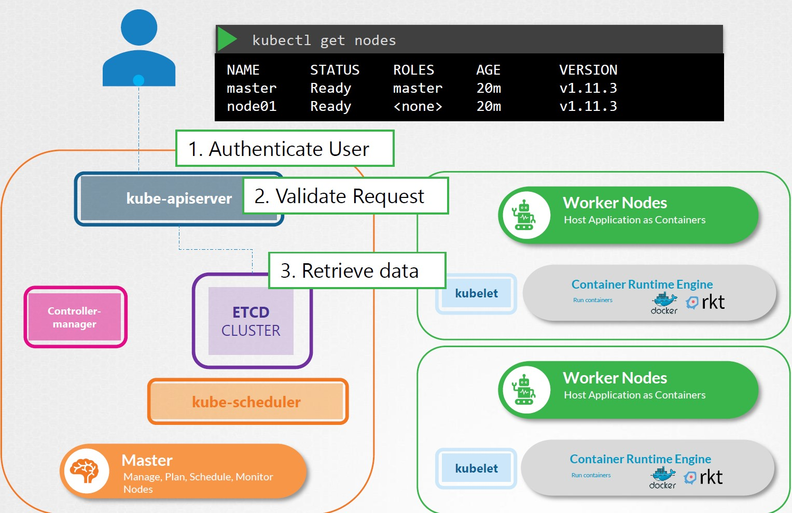

# Kubernetes CKA Personal Notes

https://github.com/mmumshad/kubernetes-the-hard-way
https://github.com/kodekloudhub/certified-kubernetes-administrator-course

What we're learning

```
High Availability Deployment
Kubernetes Scheduler
Logging / Monitoring
Application Lifecycle
Security
Maintenance
Troubleshooting
Core concepts

Auto scaling a cluster
Horizontal POD autoscalers
Stateful Sets
Kubernetes Federation
Admission Controllers
```

## Cluster Architecture

#### Commands

- If you have deploy Kubernetes with `Kubeadm`, you can see the different components in specified PODs :

```
🥃 ~ kubectl get pods -n kube-system

NAME                                 READY   STATUS    RESTARTS      AGE
coredns-787d4945fb-gslzl             1/1     Running   1 (99m ago)   23h
coredns-787d4945fb-wxhwz             1/1     Running   1 (99m ago)   23h
etcd-kubemaster                      1/1     Running   1 (99m ago)   23h
kube-apiserver-kubemaster            1/1     Running   1 (99m ago)   23h
kube-controller-manager-kubemaster   1/1     Running   1 (99m ago)   23h
kube-proxy-gcgfq                     1/1     Running   0             22h
kube-proxy-rw925                     1/1     Running   0             22h
kube-proxy-tv7wg                     1/1     Running   1 (99m ago)   23h
kube-scheduler-kubemaster            1/1     Running   1 (99m ago)   23h
weave-net-6dlz5                      2/2     Running   3 (99m ago)   22h
weave-net-bq29n                      2/2     Running   0             22h
weave-net-ls9d9                      2/2     Running   0             22h
```

&nbsp;

### ETCD

The `etcd` data store stores information regarding the cluster such as :

```
- nodes
- pods
- configs
- secrets
- accounts
- roles
- bindings
- others
```

Each data you get with `kubectl get` command is from the etcd server. Every change you make in the cluster (like adding nodes, deploying pods, etc.) are updated in the etcd server

Etcd listens to the `advertise client url` on port `2379`.

> If you deploy a cluster from scratch without the `Kubeadm` tool, you have to download the binary separately.

If you have deployed an HA environment, make sure that etcd instances know about each other by specifyin in the service the different instances of the etcd service.

&nbsp;

<!--- Center image --->
<div align="center">
  <a href="assets/CKA_Etcd_HA.jpg" target="_blank">
    
  </a>
</div>
<div align="center">
  <i>In the picture, normally you have  <b>multi master nodes</b> exposing the <b>2379</b> port where etcd services will listen.</i>
</div>

&nbsp;

#### **Commands**

https://technekey.com/check-whats-inside-the-etcd-database-in-kubernetes/

- Grab the Client certificate and key details of the API-server

```bash
🥃 ~ kubectl get pod -n kube-system -o yaml |grep -i etcd

      kubeadm.kubernetes.io/etcd.advertise-client-urls: https://192.168.56.2:2379
      component: etcd
    name: etcd-kubemaster
      - etcd
      - --cert-file=/etc/kubernetes/pki/etcd/server.crt
      - --data-dir=/var/lib/etcd
      - --key-file=/etc/kubernetes/pki/etcd/server.key
      - --peer-cert-file=/etc/kubernetes/pki/etcd/peer.crt
      - --peer-key-file=/etc/kubernetes/pki/etcd/peer.key
      - --peer-trusted-ca-file=/etc/kubernetes/pki/etcd/ca.crt
      - --trusted-ca-file=/etc/kubernetes/pki/etcd/ca.crt
      image: registry.k8s.io/etcd:3.5.6-0
      name: etcd
      - mountPath: /var/lib/etcd
        name: etcd-data
      - mountPath: /etc/kubernetes/pki/etcd
        name: etcd-certs
        path: /etc/kubernetes/pki/etcd
      name: etcd-certs
        path: /var/lib/etcd
      name: etcd-data
      image: registry.k8s.io/etcd:3.5.6-0
      imageID: registry.k8s.io/etcd@sha256:dd75ec974b0a2a6f6bb47001ba09207976e625db898d1b16735528c009cb171c
      name: etcd
      - --etcd-cafile=/etc/kubernetes/pki/etcd/ca.crt
      - --etcd-certfile=/etc/kubernetes/pki/apiserver-etcd-client.crt
      - --etcd-keyfile=/etc/kubernetes/pki/apiserver-etcd-client.key
      - --etcd-servers=https://127.0.0.1:2379
```

- Use etcdctl to query ETCD

```bash
🥃 ~ ETCDCTL_API=3 etcdctl --endpoints <ETCD-SERVER-IP:PORT> --cert=<CLIENT-CERT-FROM-ABOVE-OUTPUT> --key=<CLIENT-KEY-FROM-ABOVE-OUTPUT> --cacert=<CA-CERT-FROM-ABOVE-OUTPUT> <ETCD-SUBCOMMANDS-HERE>

# ETCD-SERVER-IP:PORT =  https://192.168.56.2:2379
# CLIENT-CERT-FROM-ABOVE-OUTPUT = /etc/kubernetes/pki/etcd/server.crt
# CLIENT-KEY-FROM-ABOVE-OUTPUT = /etc/kubernetes/pki/etcd/server.key
# CA-CERT-FROM-ABOVE-OUTPUT = /etc/kubernetes/pki/etcd/ca.crt
# ETCD-SUBCOMMANDS-HERE = member list

3ec8d20e7e3a97b3, started, kubemaster, https://192.168.56.2:2380, https://192.168.56.2:2379
```

- Checking the structure of ETCD keys (same command as above) : listing all keys stored by Kubernetes (**To run inside the etcd-master POD**). The root directory is a registry and under that we have various Kubernetes contructs.

```
🥃 ~  sudo ETCDCTL_API=3 etcdctl --endpoints https://192.168.56.2:2379 --cert=/etc/kubernetes/pki/etcd/server.crt --key=/etc/kubernetes/pki/etcd/server.key --cacert=/etc/kubernetes/pki/etcd/ca.crt get /registry/ --prefix --keys-only

/registry/apiregistration.k8s.io/apiservices/v1.

/registry/apiregistration.k8s.io/apiservices/v1.admissionregistration.k8s.io

/registry/apiregistration.k8s.io/apiservices/v1.apiextensions.k8s.io
```

&nbsp;

<!--- Center image --->
<div align="center">
  <a href="assets/CKA_Etcd_Registry.jpg" target="_blank">
    
  </a>
</div>

&nbsp;

- Querying the list of pods in the default namespace (here, the list of services in the kube-system namespace)

```
🥃 ~ sudo ETCDCTL_API=3 etcdctl --endpoints https://192.168.56.2:2379 --cert=/etc/kubernetes/pki/etcd/server.crt --key=/etc/kubernetes/pki/etcd/server.key --cacert=/etc/kubernetes/pki/etcd/ca.crt get /registry/ --prefix --keys-only |grep pods/default

# pods/default = services/specs/kube-system

/registry/services/specs/kube-system/kube-dns
```

&nbsp;

### API server

The primary management component in Kubernetes.

When running `kubectl` command, the kubectl utility is reaching to the kube-apiserver by :

```
- authenticating the request and validating it
- then retrieveing the data from the etcd cluster
- and responding back with the requested information
```

&nbsp;

<!--- Center image --->
<div align="center">
  <a href="assets/CKA_API_Server_1.jpg" target="_blank">
    
  </a>
</div>

&nbsp;

Here, the API server will create a POD :

- It will update the ETCD cluster and update the user that the pod has been created.
- The `scheduler` realizes a new pod is created without an assigned node so it will assign it to the right node and communicates that back to the API server that will update the information in ETCD server.
- Then the API server passes the information to the `kubelet` in the appropriate corker node
- The kubelet then created the POD on the node and instructs the Container RE to deploy the application image.
- Once done, the kubelet updates the status back to the API server
- Then the API server updates the data in back in the ETCD cluster

&nbsp;

<!--- Center image --->
<div align="center">
  <a href="assets/CKA_API_Server_2.jpg" target="_blank">
    
  </a>
</div>

&nbsp;

### Controller manager

It is a process that continuously monitors the state of various components within the system and works towards bringing the whole system to the desired functioning state.

It does that through the `API server`.

&nbsp;

#### **Node-Controller**

The Node-Controller :

- tests the status of the nodes every 5 seconds.
- waits for 40 seconds before declaring a node unreachable.
- After making it unreachable, it gives it 5 minutes to come back up (if it doesn't it removes the PODs assigned to this node and provision them on the healthy ones, **ONLY** if the PODs are part of a replica set).\*

&nbsp;

<!--- Center image --->
<div align="center">
  <a href="assets/CKA_Controller_Manager_1.jpg" target="_blank">
    
  </a>
</div>

&nbsp;

#### **Replication-Controller**

The Replication-Controller :

- responsible for monitoring the status of **replica sets**
- ensuring that the desired number of PODs are available at all times within the set (if a POD dies, it creates another one)

&nbsp;

<!--- Center image --->
<div align="center">
  <a href="assets/CKA_Controller_Manager_2.jpg" target="_blank">
    
  </a>
</div>

&nbsp;

We have different controllers :

<!--- Center image --->
<div align="center">
  <a href="assets/CKA_Controller_Manager_3.jpg" target="_blank">
    
  </a>
</div>

&nbsp;

### Scheduler

Responsible for scheduling / deciding which pods goes on which node (it is `kubelet` who creates the pod on the ships).

How does thse cheduler assign these pods ? It checks the hardware requirements (CPU, memory) and try yo identify the best node for the pod. By steps, by default :

```
1. Filter nodes (resource requirements)
2. Rank nodes (calculate the ammount of free resources, after having placing the pod on them)
```

This filter can be customized and we also can create our own scheduler.

<!--- Center image --->
<div align="center">
  <a href="assets/CKA_Scheduler.jpg" target="_blank">
    
  </a>
</div>

&nbsp;

### Kubelet

- They register a node in a Kubernetes cluster.
- When receiving instructions to load a container or a pod on the node, they request the container RE to pull the required image and run the instance
- Then they continue to monitor the state of the pod and containers in itand reports to the Kube API server on a timely basis.

<!--- Center image --->
<div align="center">
  <a href="assets/CKA_Kubelet.jpg" target="_blank">
    
  </a>
</div>

&nbsp;

### Kube-proxy

- Within a Kubernetes cluster, every pod can reach every other pod. It is possble by deploying a `POD virtual network` that spans across all the nodes in the cluster to which all po ds connect to.

- In 1 node we have a web application communicating with a DB (installed in the other node), by using a `service` name, who exposes the DB application accross the cluster (the name is **db**).

- Whenever a pod tries to reach the service, using its IP or name, the service will forward the traffic to the backend pod.

- The service can not join the POD network because it is not a container or pod, it doesn't have any interfaces or an actively listening process. **It is a virtual component that only lives in `Kubernetes memory`**

&nbsp;

> The service should be accessible accross the cluster from any nodes. It is possible due to a `Kube-proxy`.
>
> It is a process running on each node in the Kubernetes cluster.
>
> Its job is to look for new services and every time a new service is created, it creates the appropriate rules on each node to forward traffic to those services to the pods.
>
> One way to create the rules, it is by using `IP tables` rules.

<!--- Center image --->
<div align="center">
  <a href="assets/CKA_Kube_Proxy.jpg" target="_blank">
    
  </a>
</div>

<div align="center">
  <i>In this case, the kube-proxy creates an <b>IP table rule</b> on each node in the cluster to forward traffic (from <b>10.32.0.14</b>) heading to the IP service (<b>10.96.0.12</b>) to the IP of the actual pod (<b>10.32.0.15</b>)</i>
</div>

&nbsp;
